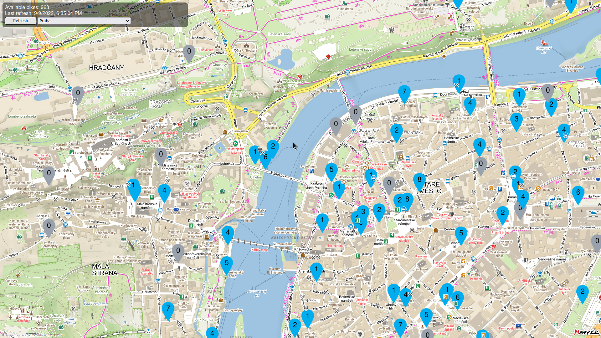

# Mapy.cz nextbike map
A really simple "static" website showing a map of bike parking spots available on the Nextbike app, since Nextbike doesn't provide a desktop/web version of the live availability map.

Using [jQuery](https://jquery.com/), [Mapy.cz API](https://api.mapy.cz/) and NextBike non-public(?) API.


## Screenshot



## How to use
### Clone repo:
```bash
git clone https://github.com/chinese-soup/nextbike-mapycz.git
cd nextbike-mapycz
```
### Open index.html in your favourite browser
```bash
firefox index.html
```
### Or host on an HTTP server, e.g.
```bash
$ python3 -m http.server
Serving HTTP on 0.0.0.0 port 8000 (http://0.0.0.0:8000/) ...
```


## Attribution
Original `Map_marker.svg` by

[Andrew Onorato, modified by User:Psubhashish](https://commons.wikimedia.org/wiki/File:Map_marker.svg), [CC BY-SA 3.0](https://creativecommons.org/licenses/by-sa/3.0), via Wikimedia Commons